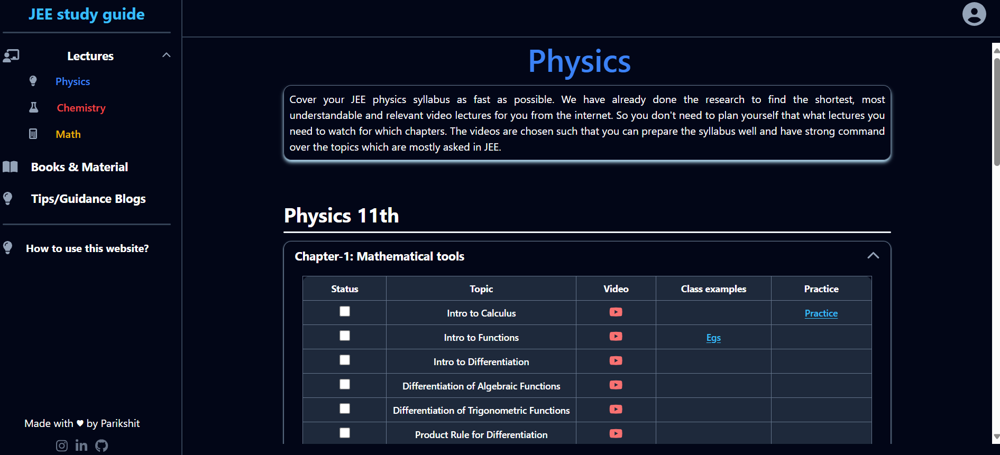

JEE study guide is a platform for those students who are self-studying for JEE and want a to the point streamlined preparation plan and resources!  
Currently only the frontend part has been built, but backend will be integrated soon and addition of content(lectures, practice problems, blogs) will be done as soon as possible
  

